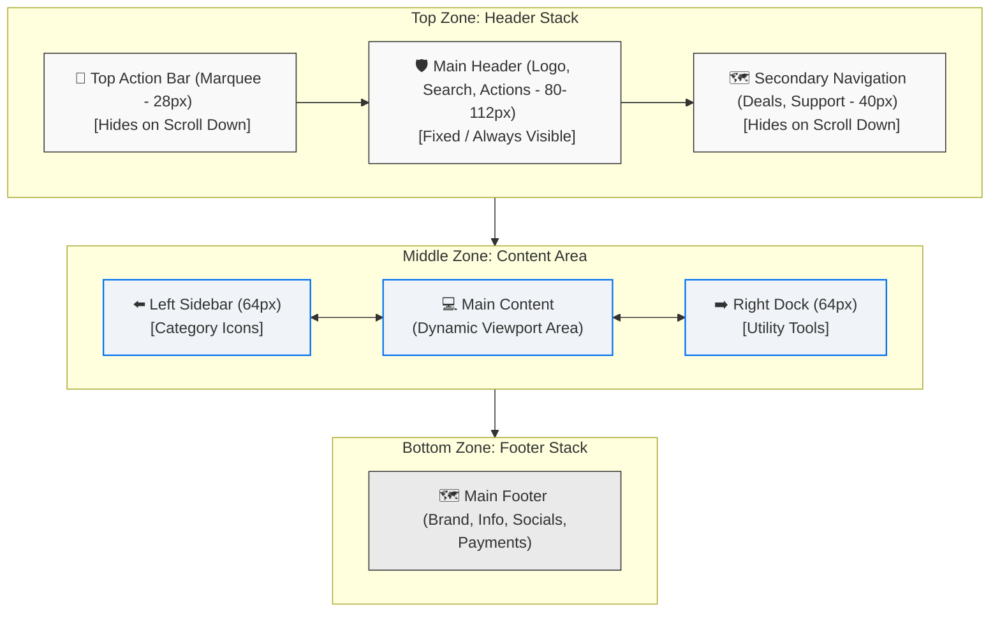
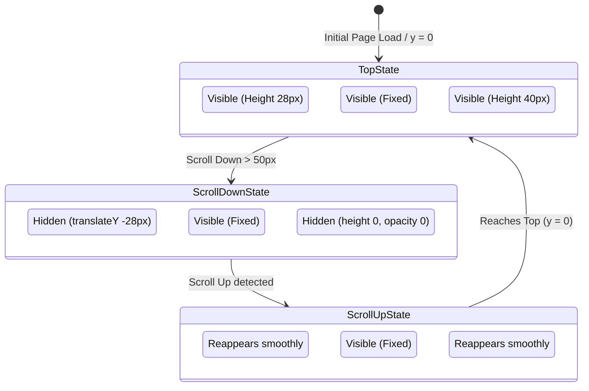
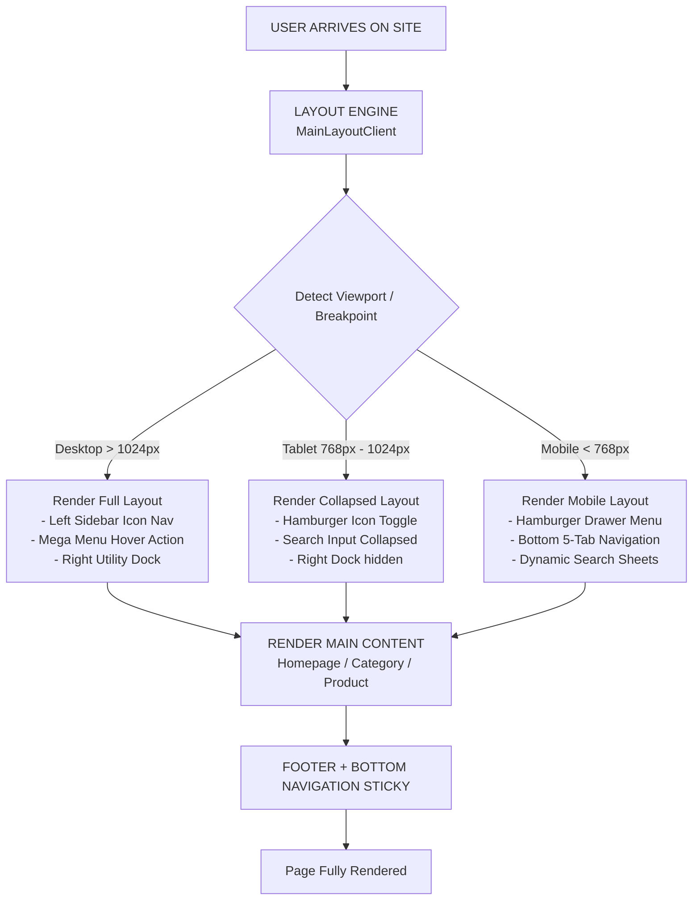

```markdown
# PocketValue E-Commerce Platform – App Shell Architecture & Homepage Behavior

## 1. Overall Layout Architecture (App Shell with Persistent Navigation)

### 🌳 App Shell Hierarchy (Tree Flow)

```
📂 App Shell Layout
├── 🌐 Top Zone (Header Stack)
│   ├── 📢 TopActionBar (Announcements Marquee) ── [Hide on Scroll Down / Show on Scroll Up]
│   ├── 🛡️ MainHeader (Fixed Header) ───────────── [Always Visible]
│   └── 🗺️ SecondaryNav (Quick Links) ─────────── [Hide on Scroll Down / Show on Scroll Up]
├── 🔄 Middle Zone (Dynamic Content Area)
│   ├── ⬅️ Left Sidebar (Category Icons) ──────── [Desktop Only, Hover opens Mega Menu]
│   │   └── 📋 Mega Menu (Nested Categories)
│   ├── 💻 Main Content (Dynamic Page Content)
│   │   ├── 🖼️ Hero Section (Full-width Banner)
│   │   ├── 🏗️ Page Builder Sections (Deals, Products, Categories)
│   │   └── 🛒 Related Products
│   └── ➡️ Right Dock (Utility Tools) ──────────── [Desktop Only: Help, Chat, Theme, Top]
└── 🧭 Bottom Zone (Footer & Mobile Actions)
    ├── 🗺️ MainFooter (Information Grid) ──────── [Desktop Grid / Mobile Accordion]
    └── 📱 BottomNav (Mobile Only) ────────────── [Fixed 5-Tab Navigation]
```

### 📐 Layout Structure (Visual Flowchart)

Niche diya gaya diagram desktop viewport par App Shell ke mukhtalif zones ko visual taur par dikhata hai:



---

## 2. Layout Components Breakdown

### 2.1 Top Zone (Header Stack)

| # | Component | Desktop | Mobile | Behavior & Specifications |
|---|---|---|---|---|
| **1** | **TopActionBar** | ✅ Full-width | ✅ Full-width | Auto-scroll marquee with announcements. Height: `28px`. Hides on scroll down, shows on scroll up. |
| **2** | **MainHeader** | ✅ Fixed | ✅ Fixed | Always visible. Height: `80-112px` (responsive). Contains logo, search bar, visual search, cart, wishlist, and account actions. |
| **3** | **SecondaryNav** | ✅ Full-width | ❌ Hidden | Contains quick links (Deals, Gift Cards, Sell, Track Order). Height: `40px`. Hides on scroll down, shows on scroll up. |

### 2.2 Middle Zone (Content Area)

| # | Component | Desktop | Mobile | Behavior & Specifications |
|---|---|---|---|---|
| **4** | **Left Sidebar** | ✅ `64px` | ❌ Hidden | Category icons (Home, Beauty, Men, Women, Kids, etc.). Hover opens Mega Menu. |
| **5** | **Mega Menu** | ✅ On hover | ❌ Hidden | Detailed nested categories and subcategories. Opens dynamically on hovering Left Sidebar. |
| **6** | **Main Content** | ✅ Dynamic | ✅ Dynamic | Page-specific viewport area rendering Hero Banners, Page Builder sections, and grids. |
| **7** | **Right Dock** | ✅ `64px` | ❌ Hidden | Utility tools: Help, Live Chat, Theme Switcher (Light/Dark), and Back to Top action. |
| **8** | **Mobile Menu** | ❌ Hidden | ✅ Hamburger | Slide-out drawer menu containing all categories with nested accordion levels. |
| **9** | **Search Panel** | ❌ Hidden | ✅ Bottom sheet | Search input with visual search trigger and recent searches list. |

### 2.3 Bottom Zone (Footer + Mobile Nav)

| # | Component | Desktop | Mobile | Behavior & Specifications |
|---|---|---|---|---|
| **10** | **MainFooter** | ✅ Full-width | ✅ Full-width | 4-column structured grid on desktop; turns into expandable collapsible accordions on mobile devices. |
| **11** | **BottomNav** | ❌ Hidden | ✅ Fixed bottom | Sticky 5-tab menu: `[Home] [Catalog] [🔍 Search] [Offers] [Profile]`. Includes visual safe-area paddings. |

---

## 3. Scroll Behavior (Auto-Hide Header)

### 📊 Scroll State Transitions

Yeh flowchart batata hai ke scroll direction aur window offset ke mutabik layout kis tarah tabdeel hota hai:



### 🎯 Behavior Specifications

| Element | Scroll Down ($y > 50\text{px}$) | Scroll Up ($y < 50\text{px}$ or positive offset) | Transition Style / Duration |
|---|---|---|---|
| **TopActionBar** | ❌ Hides (`translateY -28px`) | ✅ Shows (`translateY 0`) | `300ms ease-out` |
| **MainHeader** | ✅ Stays fixed | ✅ Stays fixed | No change in state |
| **SecondaryNav** | ❌ Hides (`max-h-0`, `opacity-0`) | ✅ Shows (`max-h-10`, `opacity-100`) | `300ms ease-in-out` |
| **Main Content** | ✅ Top padding adjusts dynamically | ✅ Top padding adjusts dynamically | `300ms ease-out` |

---

## 4. Responsive Behavior

### 📱 Breakpoints & Adaptive Layout Changes

| Device | Breakpoint | Layout Changes |
|---|---|---|
| **Mobile** | `< 768px` | - Left Sidebar hidden $\rightarrow$ Hamburger menu.<br>- Right Dock hidden.<br>- Bottom Nav (5-tab navigation) appears at the bottom.<br>- Secondary Nav is completely hidden.<br>- TopActionBar remains active with adjusted fonts. |
| **Tablet** | `768px` – `1024px` | - Left Sidebar is hidden; categories accessed via Hamburger trigger.<br>- Right Dock utility tools collapse into overflow menu.<br>- Secondary Nav is hidden to conserve vertical space.<br>- Search input field in the header collapses into a toggle icon. |
| **Desktop** | `> 1024px` | - All desktop app shell components are fully visible.<br>- Left Sidebar displaying category icons is active.<br>- Hovering over the sidebar opens the Mega Menu overlay.<br>- Right Dock is rendered on the right border. |

---

## 5. Key Features Summary

### 🔥 Core Features & Enhancements

| # | Feature | Detailed Technical Description |
|---|---|---|
| **1** | **Auto-Hide Header** | Smart scroll detection mechanism. It minimizes non-critical UI components (Top Action Bar & Secondary Nav) on scroll down to offer more reading space, and restores them on scroll up. |
| **2** | **Multi-Level Navigation** | Desktop uses an optimized two-stage hover system (`Sidebar Icon` $\rightarrow$ `Hover` $\rightarrow$ `Mega Menu` $\rightarrow$ `Subcategories`). Mobile relies on a progressive disclosure accordion structure inside the Hamburger. |
| **3** | **Right Dock Utility** | Provides permanent sidebar shortcuts for Help center access, opening chat widgets, toggling page dark/light mode, and smooth scrolling to the top. |
| **4** | **Mobile Bottom Nav** | Thumb-friendly sticky bar with five essential touch targets including a centrally highlighted Search layout. |
| **5** | **Persistent Badge Counters** | Live dynamic badge rendering on Cart and Wishlist items across both mobile navigation bars and desktop header sections. |
| **6** | **Visual Search** | Next-generation search input featuring integrated camera support for modern, AI-powered reverse-image product lookups. |
| **7** | **Theme Support** | Seamless runtime CSS variable toggling between light and dark themes with client-side setting persistence. |
| **8** | **Safe Area Support** | Built-in layout rules utilising `env(safe-area-inset-bottom)` to protect bottom navigation links from clipping on notched devices. |

---

## 6. Technology Stack for Layout

| Component | Selected Technology | Use Case & Integration |
|---|---|---|
| **Layout Framework** | Next.js 16 (App Router) | Serves as the application skeleton, supporting server components (`RSC`) and layout optimization. |
| **Styling** | Tailwind CSS | Utility-first styling framework to facilitate highly responsive layouts and responsive breakpoints. |
| **Animations** | Framer Motion + GSAP | Complex scroll transitions, height adjustments, and mega menu layout animations. |
| **State Management** | React Context (Zustand-like) | Manages global layout states such as theme preferences, sidebars, and user cart indicators. |
| **Icons** | Lucide React | High-performance, clean, SVG-based vector icons designed for optimal styling. |
| **Typography** | Clash Font (custom) | Bold editorial geometric sans-serif typeface to give the brand a premium look. |
| **Responsive Design** | Mobile-first with Tailwinds | Built with a mobile-first philosophy to optimize load speed and interaction on mobile viewports. |

---

## 7. Performance Optimizations

| # | Optimization | Technical Implementation Details |
|---|---|---|
| **1** | **Debounced Scroll Event** | Scroll listeners utilize `requestAnimationFrame` hooks to prevent browser reflow delays during scroll animations. |
| **2** | **Memoized Components** | High-use structural components like the static areas of the Navigation headers are optimized using `React.memo`. |
| **3** | **Lazy Loading Components** | Use of dynamic imports with React `Suspense` limits the initial page payload to immediately visible elements. |
| **4** | **Image Optimization** | Next.js `Image` optimizes content delivery using auto-formatted modern web images (AVIF/WebP) with custom dimensions. |
| **5** | **Code Splitting** | Heavy third-party bundles (such as Live Chat widgets) are split and only loaded on explicit user hover or click. |
| **6** | **Edge-Side Caching** | Global category systems utilize `unstable_cache` techniques to serve navigation lists directly from closest Edge servers. |
| **7** | **CDN Deployment** | Built with Vercel's global Edge network to ensure asset and document loading times remain exceptionally low. |

---

## 8. Benefits of This Architecture

### ✅ For Users
- **Effortless Navigation:** Primary interactive zones (Header, Search, and Cart) are accessible at any point of scroll.
- **Enhanced Screen Real Estate:** De-clutters workspace dynamically on scroll down to allow full focus on products.
- **Intuitive Visual Hierarchy:** Predictable layout structure helps establish user trust and simplifies browsing.
- **Responsive Adaptability:** Clean, uniform experience whether browsing on a high-res workstation or a smaller mobile screen.

### ✅ For Business
- **Premium Brand Value:** Clear layout structure elevates brand perception to compete with enterprise-tier players.
- **Increased CR & AOV:** Persistent visibility of cart indicators, search features, and relevant offers drives conversions.
- **Mobile-First Revenue Optimization:** Tailored design on mobile viewports improves the shopping journey for mobile traffic.
- **SEO Optimization:** Semantic HTML structure ensures accurate indexation by modern search engine crawler bots.

### ✅ For Developers
- **Component Reusability:** Modular app shell structures let developers build isolated sub-features.
- **Developer Scalability:** Predictable standard layout files ensure simple onboarding and rapid interface additions.
- **Enforced Separation of Concerns:** Layout, page contents, animations, and configurations remain isolated.

---

## 9. Visual Flowchart Summary

This diagram illustrates the logic applied during layout selection and page rendering when a visitor requests the site:



---

## 10. Summary

The architecture of the **PocketValue E-Commerce Platform** represents a **"Modern Enterprise-Grade E-Commerce App Shell with Persistent Navigation and Auto-Hide Header"**. 

By using adaptive breakpoints, intelligent scroll state animations, and a decoupled page layout engine, this architecture delivers a high-performance framework tailored to modernize the e-commerce shopping experience.

---
*Prepared for PocketValue E-Commerce Platform – Architecture Documentation v1.0*
```